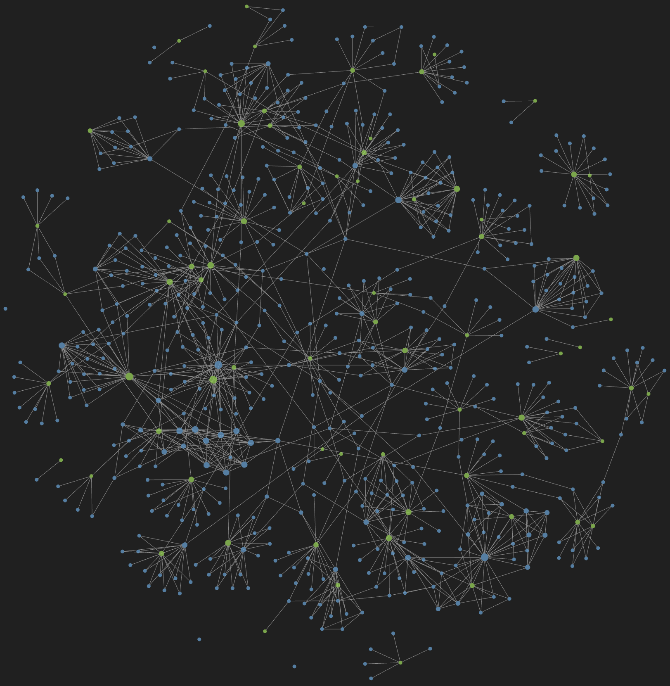

# Archive

개인 학습 기록과 기술 노트를 모아 둔 디지털 가든입니다. [Quartz 4](https://quartz.jzhao.xyz/)로 Markdown 문서를 정적 사이트로 빌드하며, 게시된 사이트는 [albert-jeong.pages.dev](https://albert-jeong.pages.dev)에서 볼 수 있습니다.



## 콘텐츠 구성

노트는 ACM Computing Classification System과 PARA를 바탕으로 분류합니다.

| 경로 | 주제 |
| --- | --- |
| `content/C0_Liberal Arts` | 인문학, 심리학, 철학 |
| `content/C1_Mathematics` | 미적분, 선형대수, 확률과통계 |
| `content/C2_Theory` | 전산학, 자료구조, 알고리즘 |
| `content/C3_Hardware` | 디지털 논리, 컴퓨터구조 |
| `content/C4_Systems` | 운영체제, 데이터베이스, 네트워크, 인프라 |
| `content/C5_Software` | 프로그래밍언어, 프론트엔드, 소프트웨어공학 |
| `content/C6_Methodologies` | 인공지능, PyTorch |
| `content/C7_Apply` | 지식의 응용과 실습 |

현재 공개 노트의 전체 목록과 집계는 [`content/index.md`](content/index.md)에서 확인할 수 있습니다.

## 로컬 실행

Node.js 22 이상과 npm 10.9.2 이상이 필요합니다.

```bash
npm ci
npx quartz build --serve
```

명령을 실행한 뒤 터미널에 표시되는 로컬 주소로 접속합니다. 정적 사이트만 빌드하려면 다음 명령을 사용합니다.

```bash
npx quartz build
```

## 노트 게시

`content/` 아래의 Markdown 파일이 사이트 콘텐츠가 됩니다. Obsidian vault에서 공개 노트를 가져오려면 `copy.sh`의 `SRC` 경로를 확인한 뒤 실행합니다.

```bash
./copy.sh
```

스크립트는 frontmatter에 `draft: false`가 지정된 문서만 복사합니다. 실행할 때 기존 `content/` 내용은 `.gitkeep`을 제외하고 삭제되므로, 커밋하지 않은 변경 사항이 없는지 먼저 확인하세요.

## 주요 설정

- 사이트 설정과 플러그인: `quartz.config.ts`
- 페이지 레이아웃: `quartz.layout.ts`
- 스타일 재정의: `quartz/styles/custom.scss`
- 공개 콘텐츠: `content/`

타입과 코드 스타일은 `npm run check`, 테스트는 `npm test`로 확인할 수 있습니다.

## 라이선스

Quartz 소스 코드는 [`LICENSE.txt`](LICENSE.txt)의 MIT License를 따릅니다. `content/`의 문서는 별도 허가 없이 재배포할 수 없습니다.
